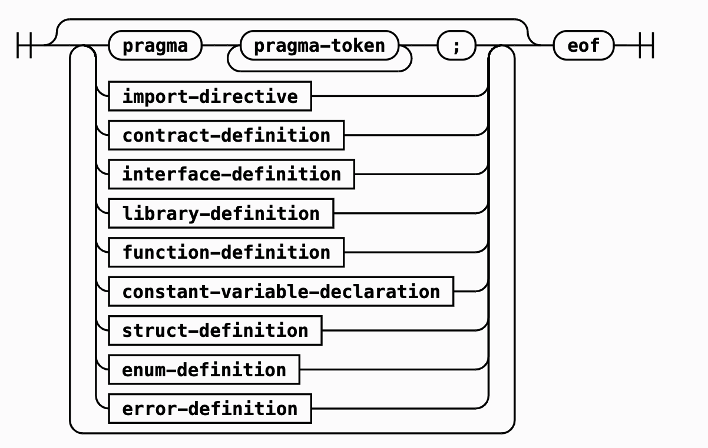
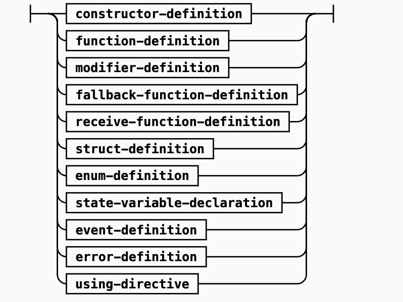

# 学习solidity

-----------------------

目标受众: 区块链从业者，且有区块链2.0基础概念，智能合约相关概念。

`版本: 0.8.0`

官方文档：

- 中文: https://learnblockchain.cn/docs/solidity/index.html

- 英文: https://docs.soliditylang.org/en/v0.8.4/index.html

**注意**: 中文官方文档中有一些错误代码，事例代码请参考英文文档。

术语:
合约: contract

类型: type

值: value

引用: reference

映射: mapping

左值: lvalue

类型转换: conversion

字面常量: literal

成员: member

数组: array

结构: structure

状态变量: state variable

函数: function

函数修改器: function modifier

事件: event

错误: error

枚举: enum

可见性: visibility

常量: contant

不可变: immutable

恢复: revert

接口: interface

库: library

抽象: abstract

----------------

#### overview概述

`solidity`是`面向对象`的，为实现`智能合约`的`高级语言`。其是特定为太坊虚拟机(EVM)设计，是`静态类型`,支持`继承(inheritance)`,`库(library)`,'自定义类型(user-defined type)',等特性。

EVM: 以太坊虚拟机是智能合约的运行时环境。它是沙箱运行并完全隔离的，EVM里运行的程序无法访问网络，文件系统，或其他的进程。且智能合约对其他的只能合约也有访问权限(通过设置可见性实现)。

##### 账户: 在以太坊有两种账户类型，**外部账户**(由pub-pv钥匙对控制)和**合约账户**(由其存储的代码控制，其地址由合约创造时决定)。无论账户是否存储代码，这两种账户类型对EVM来说都是一样的，即：1: 每一个账户都有持久化存储(叫作storage)的key-value映射对，其都是256-bit映射256-bit。2: 每个账户都有余额(balance)。

##### EVM存储: EVM有三种存储数据的区域:

- `storage`: 256-bit => 256-bit的键值对。每一个账户都拥有的数据区域，在交易和函数调用种都是持久化存在的。在一个合约中枚举所有的storage是不可能的(参考枚举map，除非知道所有的key)。storage的读写开销很大，除了合约本身之外，其他合约都不可以对storage进行读写。

- `memory`:合约为每个消息调用都会获取一个新清楚的实例。内存是线性的，可以在byte级被寻址，但是读被限制在256-bits宽度，而写的位宽既可以8-bits也可以256bits。当访问一个没有被触及到的内存字时(256-bits),会新扩展一个新的字(256-bits),在扩展期间的gas费必须被扣除，且其的gas消耗以二次方形式扩展。

- `stack`:EVM是一个栈机器，所有的计算都是在stack上进行操作的。它最多拥有1024个元素包含256-bits的字。访问stack遵循top-end规则如下：1:可以copy栈上topmost 16个元素到最顶端，或者栈顶元素与其下面的16个元素之一进行交换。2:其他的所有操作都是操作栈顶的元素，然后将操作结果压进栈。3:可以将栈上的元素放到storage或memory来访问栈深处，但是不可能在不移除栈顶元素的前提下访问栈种更深的元素。

##### EVM指令集: EVM的指令集保持最小化，以避免造成共识问题的不正确或不一致实现。**所有的指令集操作基本的数据类型，256-bit字或者memory中的数组**。

##### 消息调用: 合约可通过消息调用去调用其他合约或向非合约账户发送ether。消息调用与交易类似，都有source，target，data payoad，ether，gas和返回数据。事实上，每一个交易都是最顶层的消息调用，可以以此来生成更多的消息调用。被调用的合约将接收到一个新的被清除过的memory实例并且可以访问调用payload(在calldata区域)。当执行完后，被调合约返回数据并保存在调用者memory中，所有的调用都是同步的。且调用的深度最多为1024.所有对于一些复杂操作，循环要比递归调用更好。

-------------------



------------
#### pragma

`pragma`: 是用来制定编译器如何对待源代码的通用符。如

```solidity
pragma solidity >0.5.0 <0.8.0;	//指定源代码的solidity版本号。

pragma experimental ABIEncoderV2;	//启用支持任意嵌套的数组或结构。

pragma abicoder v1;	//默认的abi编解码方式。

pragma abicoder v2;	//支持任意桥套的的数组和结构（从0.8.0版本开始支持）
```


#### import

`import`:用来导入其他源文件。支持导入语句模块化代码。

```solidity
import "filename"; //导入此所有的全局符号到当前的全局作用域。**不建议使用，会污染当前命名空间**。

import * as symbolName from "filename";

import "filename" as symbolName;

import {symbol1 as alias, symbol2} from "filename";

//路径: 以./xxx 或者../xxx开头才是相对路径。

//重映射。

solc context:prefix=target xxx 来将代码中的import路径替换成target。
```

-----------------------------------


#### contract



合约类似于“类”，如图所示，其可包含:

- state variables声明: 永久地存储在合约中的变量。

- function定义: 代码的可执行单元，可在合约内外定义。

- function modifier定义: 以声明的方式修改函数语义。

- event定义: 调用日志功能。

- struct定义: 可以自定义变量将几个变量进行组合。

- error定义: 为失败添加描述性的名称和数据，可在revert陈述中使用。

- enum type定义:通过有限的常量值构建类型。

- receive function定义: 合约的接受函数，当向合约发起调用时的payload为空时会调用此函数。

- fallback function定义: 合约的回调函数，当向合约发起调用的函数selector不符合任何可调用函数时，默认调用此函数。

##### WARNING: SOLIDITY没有null或者nil，都是总有改类型的值(意味着无法通过判断一个map里的key是否有值来判断)

```solidity
pragma solidity 0.8.4;

contract OwnedToken {
    // `TokenCreator` is a contract type that is defined below.
    // It is fine to reference it as long as it is not used
    // to create a new contract.
    TokenCreator creator;
    address owner;
    bytes32 name;

    error NotOwner();//定义类型
    modifier onlyOwner(){
    	if (msg.sender != owner)
    		revert NotOwner();
    		
    	_;
    }

    // This is the constructor which registers the
    // creator and the assigned name.
    constructor(bytes32 _name) {
        // State variables are accessed via their name
        // and not via e.g. `this.owner`. Functions can
        // be accessed directly or through `this.f`,
        // but the latter provides an external view
        // to the function. Especially in the constructor,
        // you should not access functions externally,
        // because the function does not exist yet.
        // See the next section for details.
        owner = msg.sender;

        // We perform an explicit type conversion from `address`
        // to `TokenCreator` and assume that the type of
        // the calling contract is `TokenCreator`, there is
        // no real way to verify that.
        // This does not create a new contract.
        creator = TokenCreator(msg.sender);
        name = _name;
    }

    function changeName(bytes32 newName)public {
        // Only the creator can alter the name.
        // We compare the contract based on its
        // address which can be retrieved by
        // explicit conversion to address.
        if (msg.sender == address(creator))
            name = newName;
    }

    function transfer(address newOwner) public onlyOwner {
        // Only the current owner can transfer the token.

        // We ask the creator contract if the transfer
        // should proceed by using a function of the
        // `TokenCreator` contract defined below. If
        // the call fails (e.g. due to out-of-gas),
        // the execution also fails here.
        if (creator.isTokenTransferOK(owner, newOwner))
            owner = newOwner;
    }
}


contract TokenCreator {
    function createToken(bytes32 name)
        public
        returns (OwnedToken tokenAddress)
    {
        // Create a new `Token` contract and return its address.
        // From the JavaScript side, the return type
        // of this function is `address`, as this is
        // the closest type available in the ABI.
        return new OwnedToken(name);
    }

    function changeName(OwnedToken tokenAddress, bytes32 name) public {
        // Again, the external type of `tokenAddress` is
        // simply `address`.
        tokenAddress.changeName(name);
    }

    // Perform checks to determine if transferring a token to the
    // `OwnedToken` contract should proceed
    function isTokenTransferOK(address currentOwner, address newOwner)
        public
        pure
        returns (bool ok)
    {
        // Check an arbitrary condition to see if transfer should proceed
        return keccak256(abi.encodePacked(currentOwner, newOwner))[0] == 0x7f;
    }
}
```

#### type

类型分为值类型和引用类型。
值类型: booleans, integers, address, contract types, fixed-size arrays, dynamically-sized byte array, enums, fucntion types. 

值类型对应的操作:

- booleans: `bool`;与其他语言一样。

- integer: `int8-256/uint8-256`;与其他语言一样，且`**`带表幂操作(i.e. 2**10为1024, 0**0为1)，**幂运算只适用于无符号类型**.且可通过type(X)有成员变量min和max来获得它的最小值和最大值。**注意操作此类型有上溢和下溢出的风险**。且它的位运算是在数字的补码上执行(意味着~int256(0)==int256(-1)。且左移位操作截断结果，右移位操作必须是无符号类型。**由于负数的范围比正数大1，所以对type(X).min取反会向上溢出**。其模运算结果正负只和左边操作数有关。

- address: `address`与`address paypable`(多了两个成员变量(`transfer`,`send`));`transfer`会**因为异常而终止并回滚状态**。而`send`**只返回false**。

```text
address成员变量: 
1:balance(uint256)。查看地址在当前高度的余额。

2:call,delegatecall,staticcall:
他们都需要一个 byte memory参数并返回执行成功的状态和数据。
在调用的时候可以通过address(nameReg{eth: 100, gas: 1000}).call(xxx)来控制调用时传递的eth金额和gas数量。
值的注意的是: delegatecall 主要用来使用library code，它不支持value选项。
staticcall如果被调函数修改了此合约的状态变量，则将revert。
call不进行函数存在性检查。

3:code(bytes memory):此地址的code(可能为空)

4:codehash(bytes32):此地址的codehash。
```

- contract types:`contract`;
1:每一个合约定义自己的类型。2:可以隐式地转换成它们的继承合约。3:可以显示地转换成address。如果定义了一个本地变量MyContract C,则可以调用合约的方法。(必须声明相同的合约类型)
```text
合约相关:
1:`this`,特指当前合约，可被显示地转换成address。

2:selfdestruct(address payable recipient)毁灭当前合约并将当前合约的balance转给resipient。

类型信息:`type(C)`
1:`name`合约的名字。
2:creationCode创建合约时的代码
3:runtimeCode合约运行时的代码，
```

- fixed size arrays:`bytes[1-32]`:
保存一系列的bytes。**注意:在memory中，bytes要比byte[]更省空间，因为byte[] memory每一个字节都会占用32字节的存储空间。**
如果x是bytesI类型，可以通过x[k],0<=k,I来返回第k个字节(只读)。

- dynamically-sized byte array:`bytes`和`string`。这两个都不是值类型。

- enum types:`enum`枚举类型。

- function types:`function`。
```text
合约消息调用其他合约时，无法直接获得storage variables。

函数有五种修饰符种:
可见性:
1: internal。内部调用。只能被当前合约或当前合约的继承合约调用，这是默认的state variables可见性。
2:public。可被内部调用或EVM调用，state variable生成getter方法。
3:external。函数是合约接口的一部分，可被其他合约和交易调用，但无法被本地调用，得this.f()。
4:private。只能在被定义的合约内可见。

状态可变性:
1:view。只读状态。**当函数**被调用时，默认使用**staticcall**。保证了**EVM运行时**不会改变状态。当为`libraby`view函数时，使用delegatecall调用，会在编译时检查。
2:pure。不读不写状态。也是用staticcall调用。

modifier调用:
函数修改器。是合约的可继承属性。如果标记为virtual则可被覆盖。当使用一个合约C的modifier时，按照顺序执行。当函数还没有执行时就直接退出，则返回参数的默认值。`_`可在modifier中多次使用，`_`直接被函数体替换。在函数中可见的符号，在修改器中都可见(i.e. msg.sender)。


virtual:
标明此函数是否可被override。

override:
标明是否重写了。

接收ether函数:
receive() external payable {...} 不需要function keyword。如果没有这个接受函数，但有一个payable回调函数，则会调用此函数。
在最糟糕的情况下，此函数只有2300gas(因为send和transfer只分配2300gas)
值的注意的是: address(this).balance可能比合约中所有账户总额要高。因为selfdestruct()直接将balance分给合约。

回调函数:
fallback(bytes calldata) external returns (bytes memory){}
当调用时函数签名不匹配任何可调用函数时，将默认调用此函数。
```

#### reference type
引用类型有:structs,arrays,mappings(**只能在storage中**).
使用引用类型时，必须明确类型存在哪里。
1:`memory`: 仅在函数调用期间有效，不能用于外部调用。
2:`storage`: state variable。贯穿合约的整个生命周期。
3:`calldate`:保存函数参数的特殊位置，只读，避免复制。是外部函数参数所必须指定的位置，也可用于其他变量。
更改数据类型或类型转换都会自动copy，对于storage来说，同一位置在某些情况下也会进行copy。

- array:
在solidity中，X[3]是拥有三个X类型的数组，即使X本身也是数组。i.e.uint[][5] x;声明有五个动态数组。访问数组时的顺序正好相反，如访问第三个动态数组的第二个元素x[2][1]。

数组元素可以是任意存储类型(在memory中一个元素占位总是256bit的倍数，而storage中会紧凑排序),mappings只能被存储在storage中。public 数组会创建getter函数并返回它的引用。访问超出数组长度会导致assert类型异常。可以通过`.puch()`在末尾新增一个新的默认元素。

**值得注意的是**:bytes和string也是数组。
bytes与byte[]相似，但它在calldate和memory中连续地存放在一起。
string与bytes相同，但不允许用长度或索引来访问。如果想要访问字符串s。使用`bytes(s)`强制转换成bytes后进行操作。它访问的是UTF-8低级bytes类型。

创建memory arrays:
可使用`new`在`memory`中创建动态长度的数组。与storage不同，无法通过`.push()`改变`memory`数组的大小。所以必须计算所需大小。

数组字面常量/内联数组:
数组字面常量总是静态固定大小的`memory`内存数组。但却根据运行时的参数动态分配。数组字面常量里必须有一个元素可以隐式地转换到普通类型。i.e. uint[3] x = [uint(1),2,3];
成员members:	1:length.	2:storage:push()，返回改元素的引用，具有固定的gas消耗，因为storage总是被零初始化，pop则与元素大小有关。	3:storage: push(x)，不返回。	4:pop()。

struct和array数据总是用一个新的插槽(其后续变量也用一个新的插槽)。
storage: 会紧凑存储
memory: 每个元素始终占据43byte的倍数。
**差异对比**: uint8[4] a;在`storage`中占32字节，在`memory`中占128字节。

array slice:x[start:end]仅用于calldata。

structs:`struct` 在合约外定义的struct可被多个合约使用，

mappings:`mapping(_keyType => _valueType) variableName;`
`_keyType`只能用以内置的类型:bytes,string,contract,enum。由于map只能存储在storage中，所以无法作为函数的传入参数(public parameter)和返回参数。由于必须要拿到map的key才能找到其对应的value，所以如果要遍历所有的map，必须保存其所有的key（value中添加flag标记是否存在）。

lvalue左值: x = ...;在等号左边的值。

delete: `delete`只不过是把值初始化了。在delete数组时，将会留下空槽(i.e. [2,2,0,2,2])。所以当打算删除东西的时候，mapping更好。但无法直接删除一个map(因为压根不知道它的所有key)，但是可以`delete a[x]`(有key)。
**注意**：`delete a`就像是对a重新赋值，只会重置a本身，不会重置它之前指向的东西。

元素的类型转换:
1:impliicit无影响。低位转高位。
2:explicit有影响，高位转低位。在bytes类型转换时，向下转换会cut后面的数(i.e. bytes2 a=0x1234; bytes1 b=bytes1(a); b为0x12)。而integer则是高位被截断。同理，bytes类型向上转换时在低位补0，而integer则是在高位补0。所以bytes和integer在互相转换时，必须要求位数一样。

单位和全局变量:
ether: wei, gwei, ether.
time units: seconds, minutes, hours, days, weeks.

特殊的变量和函数:
block&tx properties: 1:blockhash(uint blockNumber) returns (bytes32). 2:block.chainid(uint). 3:block.coinbase. 4:block.number. 5:block.timestamp. 6:gasleft()returns(uint256). 7:msg.data(bytes calldata) 8:msg.sender,msg.sig,msg.value,tx.gasprice,tx.origin.


----------------

#### data location

每个引用类型都需要定义location:`memory,storage,calldata`。
数据位置与赋值行为。数据位置不仅仅表示数据如何被保存，同样也影响数据的赋值行为:

- storage <-> memory: copy

- calldate -> memory: copy

- memory -> memory: 只创建引用

- storage -> local storage: 只分配一个引用。

- 其他 -> storage: 总是copy。


---------

#### expressions and control structures

control structures:if,else,whils,do,for,break,continue,return，在external函数调用时，可使用try/catch处理错误。


函数调用:

internal: 在EVM中被解释为简单的跳转，所以当前内存不会被清除，但每一次调用至少占一个slot。

external: 消息调用没有一个地址和接口签名实现。外部调用数据必须被copy到memory中


用`new`创建合约。

用salt创建合约:因为在合约里创建合约时，另一个合约的地址是通过此合约地址和nonce计算而得。


运算的检查模式和非检查模式:

`unchecked { return a-b;}。不检查是否溢出。


错误处理:错误用来解释一个失败操作的原因。可在合约内外定义。可被继承，但无法被重写或覆盖，只能用`revert`生成此错误实例。当使用external call时，错误会被捕获到。**错误不应该用作控制流的手段，因为内部调用可以伪造错误信息**。

- assert:检查panic，消耗所有的gas，会创建一个panic(uint256),只能用于测试内部错误，检查不变量。**防止不可能发生的情况，正常的函数代码永远不会产生panic**。

- require:检查error，用来保证运行时的条件正确性，包括条件的输入或调用外部合约返回的值。require生成的是error(string)。

**!!require方法就像其他函数一样，require(condition,f())则函数f一定会执行**。


error(string):

- bytes4: function seletor

- bytes32: data offset

- bytes32: string length

- bytes32: string data

try/catch 用于捕捉外部调用的错误。

**contract类似于面向对象的类，当调用一个不同的合约实例的方法时，它会调用EVM的函数调用，所以切换了context，从而无法访问到被调合约的状态变量。


创建合约:1.eth tx创建。2.合约内部创建。

构造函数: `constructor`不支持重载。构造函数执行完成后，合约的最终代码将部署到链上，此代码包括所有公共和外部函数。以及所有可用函数调用访问的函数。**没有构造函数代码**。如果一个合约想要创建另一个合约，创建合约需要知道被创建合约的源代码和二进制代码。意味着无法循环创建依赖。


#### constant和immutable state storage.

constant:在编译时就确定的值。

immutable:可在构建时赋值。

**编译器不会为这些预留slot**

events:时eth的log方法的抽象。app可以监听事件，出发后存储在tx的log与合约的地址相关联，存进chain。
可以加`indexed`属性给最多三个参数，这样会把它们加到特殊的“topic”数据结构，会以它们的keccack256(p)为索引，除非用`annoymous`说明符。


#### inheritance继承

支持多重继承和多态。

- 多态: 函数调用会执行最近的同名函数，除非特意表示"virtual" "override"。可以特意使用 contraceName.functionName()或super.functionName()来调用更高层的合约。

- 继承：**当一个合约继承了很多合约时，只有一个合约被创建，其他合约也被编译到此合约**。state variable shadowing不被允许(即派生合约不可声明其父合约已有的state variable)。且派生合约可直接获得非private属性的东西。当想要override一个函数时，需要加override关键字，且函数的签名必须一致，如果构造函数有多个参数，则继承时就绪写入。由于多重继承会有`diamond problem`，所以它与python类似使用C3-linearization，强制基类保持DAG的顺序，即从最base到最derived。当一个被多次定义的函数被调用时，给定的基类以右->左按深度优先进行搜索。继承有相同的名字和不同类型成员也会报错:function <-> modifier.function <-> event. event <->modifier。

override:一定显式地override。可见性只能从大到小。重写多个合约的方法得override(xxx,xxx)，且private函数不可被override(因为不可达)。
**public state variableu会自动生成getter方法**。modifier override和上面一样。


#### 函数修饰符

`abstract`: 只要存在一个未实现的方法，则需要被标记为abstract(全部实现也可标记)。参数无法被外部assigned，只能通过派生合约的构造函数进行赋值。

construcror的参数: 可直接定义(常量或定义合约的行为或描述)。也可在构造函数中modifier(取决于派生合约)。如果派生合约没有给所有的base合约的构造器输入参数，它会是一个abstract合约。

#### interface
类似abstract，但不能有方法的实现。它遵循一下规则:

- 不能继承合约，只有继承接口

- 所有声明函数必须为external

- 不能定义constructor

- 不能定义 state variables

接口由合约的ABI接口限定，接口里的函数被隐式地声明为`virtual`。

#### library

库与接口类似，但它们只需要在具体的地址定义一次，则它们的代码可通过delegatecall重用。如果库函数没有被调用，它的代码在调用合约中的上下文执行，所以**重用`this`指向调用此函数的合约**,**可访问调用此合约的state variables`。**库函数是无状态的，只能直接调用，它们是代码的一部分**。library可看成基合约(使用方法)，内部调用也使用JUMP跳转，在编译时就已经将库函数包含到调用合约中了。

可通过`adderss(libraryName)`获得库地址，由于编译器不知道库会被谁调用，所以编译出来的会包含占位符36byte。是keccack256(完整的库名称)

`using libraryName for 类型`。
库没有state variable，无法继承，无法接受ether，无法被销毁。

库的函数签名和selectors:尽管可以对public/external库函数进行外部调用，但还是会被视为内部调用。所以external library比external contract支持更多的参数类型。可通过判断地址来判断库正在哪里运行(是否在本合约跑)。

```solidity
using libraryA for typeB; //把A的方法绑到B类型上(在此合约的context中)。
```


